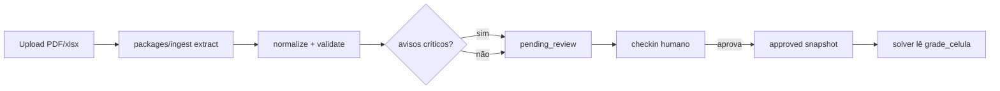

# ADR-008 — Ingestão com snapshot aprovado

**Status:** Aceito  
**Data:** 2026-08-10  
**Confiança:** 🟢

## Contexto

No legado, `GRADES` está hardcoded dentro de `gerar_calendario.py` (~linha 203). A extração de PDF/xlsx (`extrair_grade_*.py`) gera outro artefato (`.py`), exigindo colagem manual antes de gerar o calendário. O ERD já prevê `grade_celula`, mas a migration T2 não a criou. O solver não deve re-parsear PDF a cada job — isso é lento, não determinístico e consome tokens quando se tenta resolver via IA.

## Decisão

1. **Pipeline determinístico em `packages/ingest`** — extração PDF/xlsx/legado → normalização → validação → avisos. Código Python reutiliza geometria de `extrair_grade_2025.py`; IA só para OCR/layout excepcional (fallback tesseract), nunca para decidir slots de prova.
2. **Snapshot imutável `ingest_snapshot`** — cada upload gera um snapshot com status (`draft` → `pending_review` → `approved` | `rejected`). Células ficam em `grade_celula` ligadas ao snapshot.
3. **Aprovação humana obrigatória** — coordenador revisa avisos (CLI `ingest checkin` ou UI futura) antes de `approved`. Solver e worker **só leem** snapshot `approved` do semestre.
4. **Contrato `GradeSnapshot`** — tipo compartilhado entre ingest, API e solver; converte para dict legado `GRADES` quando necessário para paridade.

## Alternativas consideradas

| Opção | Rejeitada porque |
|---|---|
| Re-parse PDF no worker a cada job | Lento, não idempotente, OCR instável |
| IA interpreta grade inteira por prompt | Alto custo de tokens; erros silenciosos |
| Grade só em blob JSON sem BD | Sem versionamento, sem gate de aprovação |
| Manter colagem manual `.py` | Não escala multi-coordenador |

## Consequências

- Novas tabelas: `ingest_snapshot`, `grade_celula` (migration T3b)
- Novo pacote: `packages/ingest` (T3c)
- CLI revisor: `python -m ingest checkin` (T3d)
- Tarefa solver (T5, ex-T4) recebe `GradeSnapshot` aprovado, não caminho de PDF
- Specs `extracao-grade` e `geracao-calendario` referenciam contrato comum
- API upload grade (T8+) persiste snapshot `draft` e dispara job de extração

## Fluxo

