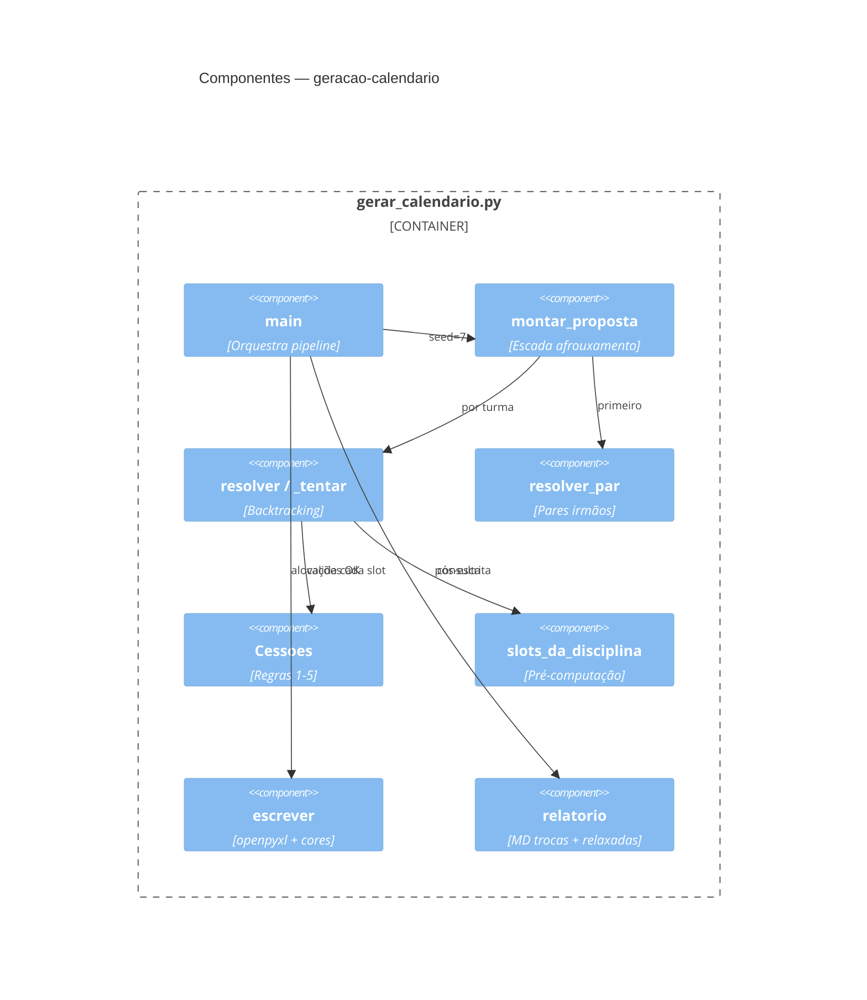
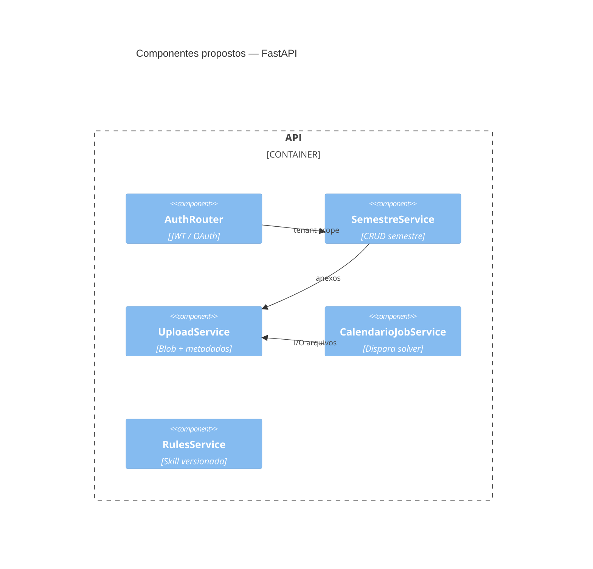

# C4 — Componentes (Nível 3)

## Container: Scripts Python CLI (legado)

## Container: API Backend (futuro) 🟡

## Acoplamentos críticos

| De | Para | Tipo |
|---|---|---|
| `verificar_calendario.py` | `gerar_calendario` | import direto 🟢 |
| `exportar_tempos_cedidos.py` | `gerar_calendario` + `exportar_tabelas_turma` | import 🟢 |
| Exportadores | xlsx em disco | leitura pós-gravação 🟢 |
