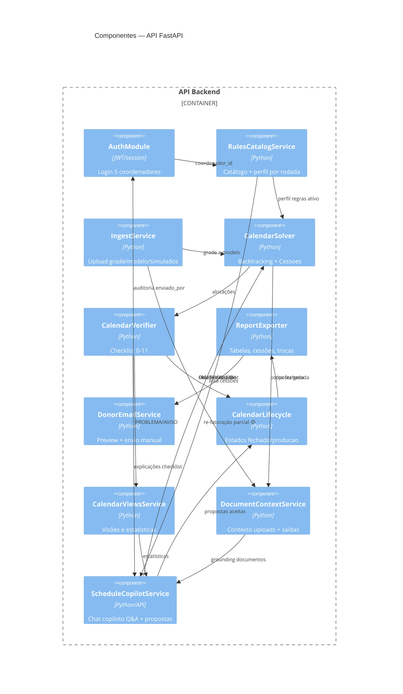
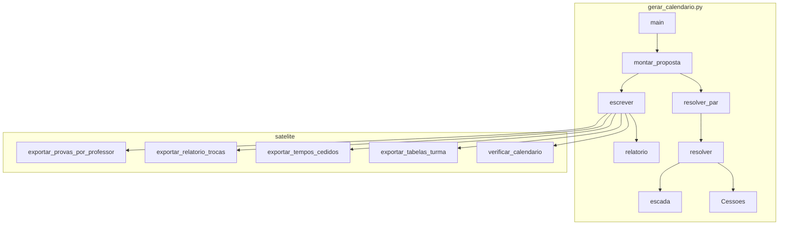

# C4 — Componentes (Nível 3)

> Gerado pelo Arquiteto (Reversa) em 2026-08-15

## API Backend (alvo) 🟡

## CLI Legado (as-is) 🟢

### Mapeamento legado → API 🟡

| Componente legado | Componente alvo |
|---|---|
| `montar_proposta` + `resolver*` | `CalendarSolver` |
| `Cessoes` | `CalendarSolver.Cessoes` (módulo) |
| `verificar_calendario.main` | `CalendarVerifier` |
| `exportar_*` | `ReportExporter` |
| Skill Passo 0 + regras | `RulesCatalogService` + UI |
| — | `DonorEmailService` (novo) |
| Skill + chat Cursor/Claude hoje | `ScheduleCopilotService` + `DocumentContextService` (novo 🟡) |
| `commit_github.bat` | `CalendarLifecycle` + Git opcional |

## Frontend (alvo) 🟡 — componentes UI

| Componente UI | Feature Reversa |
|---|---|
| `RulesSelectionWizard` | Seleção regras Tela 1–2 |
| `CalendarEditor` | Refração manual (grid xlsx) |
| `ScheduleCopilotChat` | Chat copiloto pós-geração (Q&A + alterações) 🟡 |
| `ProblemViewsPanel` | Estatísticas / visões alinhadas ao copiloto 🟡 |
| `VerificationPanel` | Checklist PROBLEMA/AVISO |
| `CloseCalendarAction` | Fechar horário |
| `DonorEmailPanel` | Preview + envio e-mail doadores |
