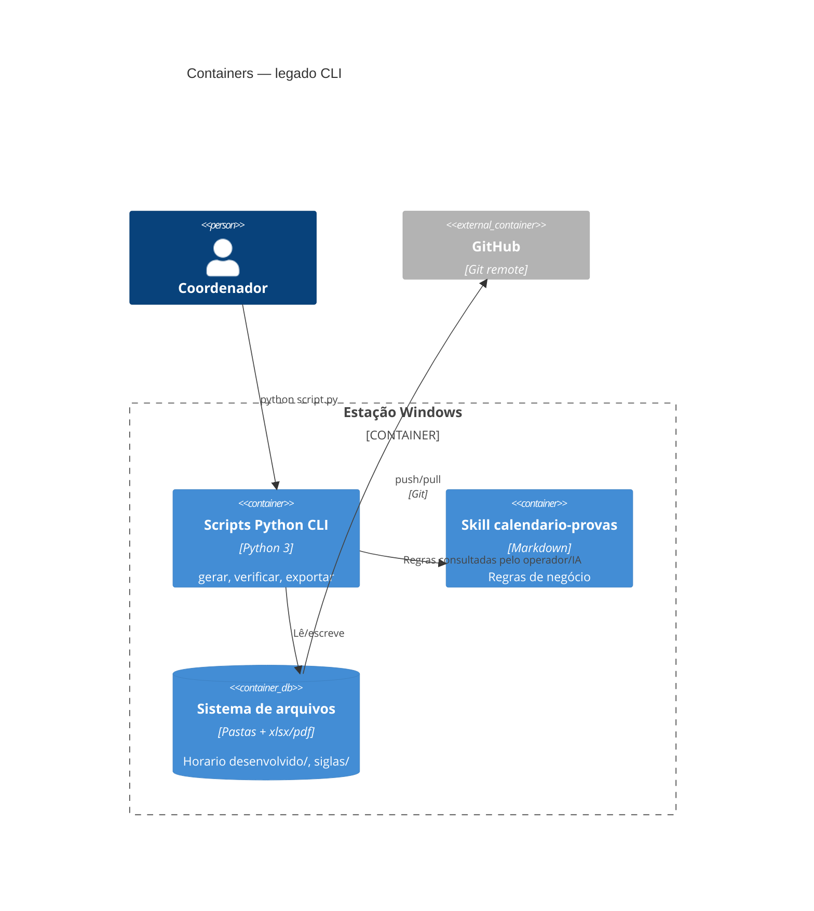
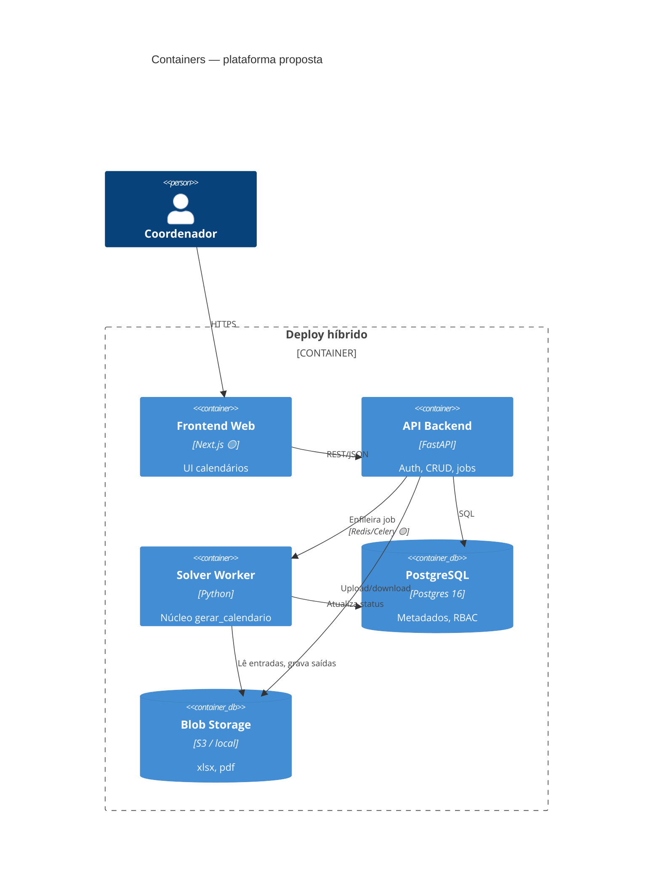

# C4 — Containers (Nível 2)

## Legado (atual)

```mermaid
C4Container
    title Containers — legado CLI

    Person(coord, "Coordenador")

    Container_Boundary(local, "Estação Windows") {
        Container(cli, "Scripts Python CLI", "Python 3", "gerar, verificar, exportar")
        Container(skill, "Skill calendario-provas", "Markdown", "Regras de negócio")
        ContainerDb(fs, "Sistema de arquivos", "Pastas + xlsx/pdf", "Horario desenvolvido/, siglas/")
    }

    Container_Ext(github, "GitHub", "Git remote")

    Rel(coord, cli, "python script.py")
    Rel(cli, fs, "Lê/escreve")
    Rel(cli, skill, "Regras consultadas pelo operador/IA")
    Rel(fs, github, "push/pull", "Git")
```

## Futuro (proposto)

```mermaid
C4Container
    title Containers — plataforma proposta

    Person(user, "Coordenador")

    Container_Boundary(cloud, "Deploy híbrido") {
        Container(web, "Frontend Web", "Next.js 🟡", "UI calendários")
        Container(api, "API Backend", "FastAPI", "Auth, CRUD, jobs")
        Container(worker, "Solver Worker", "Python", "Núcleo gerar_calendario")
        ContainerDb(pg, "PostgreSQL", "Postgres 16", "Metadados, RBAC")
        ContainerDb(blob, "Blob Storage", "S3 / local", "xlsx, pdf")
    }

    Rel(user, web, "HTTPS")
    Rel(web, api, "REST/JSON")
    Rel(api, pg, "SQL")
    Rel(api, blob, "Upload/download")
    Rel(api, worker, "Enfileira job", "Redis/Celery 🟡")
    Rel(worker, pg, "Atualiza status")
    Rel(worker, blob, "Lê entradas, grava saídas")
```
