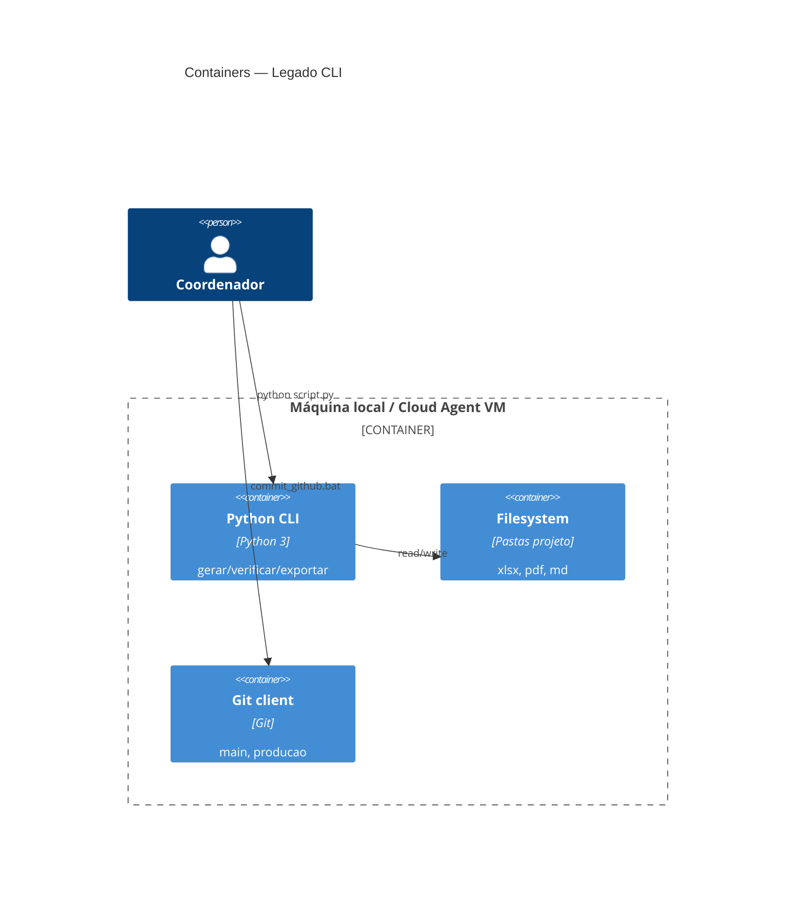
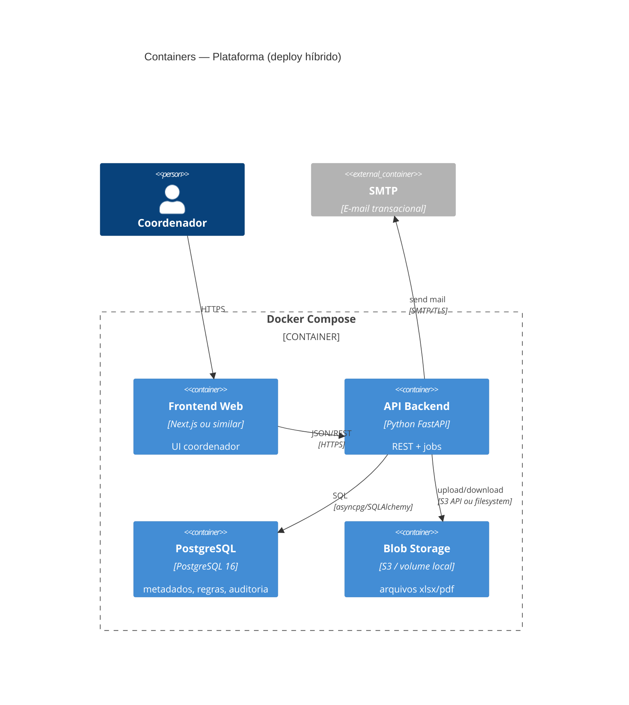

# C4 — Containers (Nível 2)

> Gerado pelo Arquiteto (Reversa) em 2026-08-15

## Legado 🟢

## Alvo 🟡 — Docker Compose

### Responsabilidades por container

| Container | Responsabilidade | Origem legado |
|---|---|---|
| **Frontend** | Telas regras, fatoração, refração, fechar, envio e-mail | Novo |
| **API** | Orquestra solver, verificador, exportadores, auth | `gerar_calendario.py` + satélites |
| **PostgreSQL** | Usuários, calendários, perfis regras, log e-mails | Novo |
| **Blob** | Modelos, grades PDF, propostas xlsx | Pastas locais atuais |
| **SMTP** | E-mail doadores | Relatório trocas (manual hoje) |
