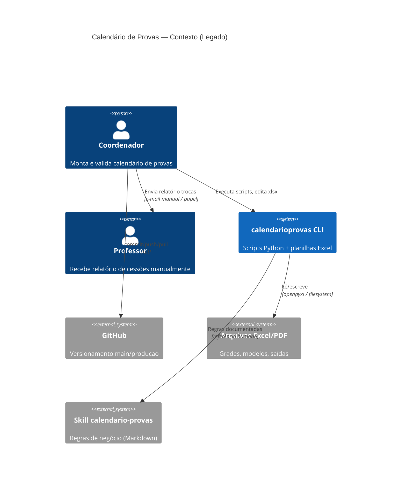
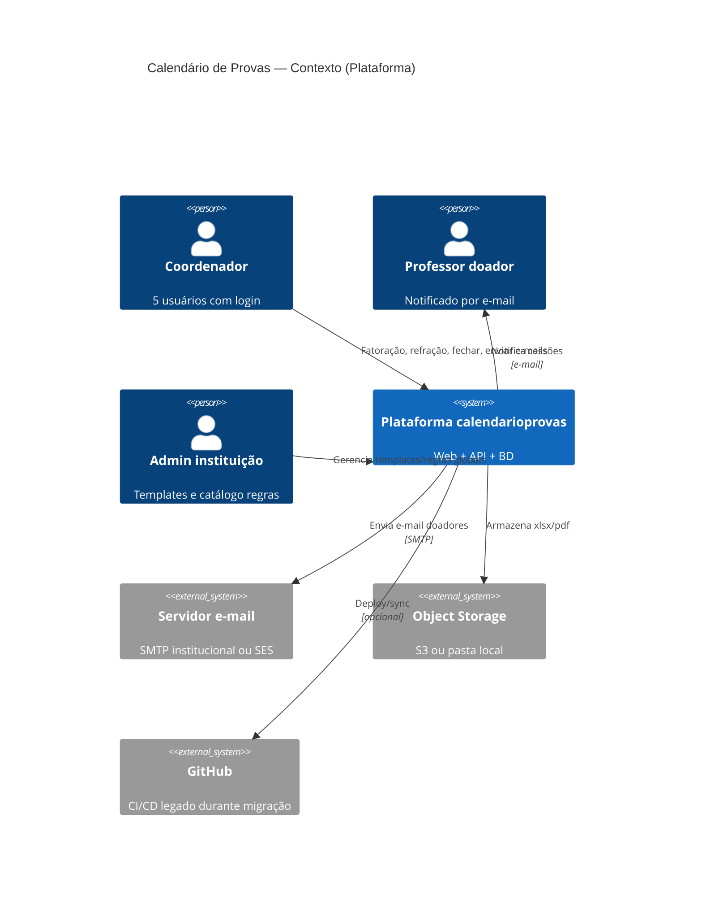

# C4 — Contexto (Nível 1)

> Gerado pelo Arquiteto (Reversa) em 2026-08-15

## Legado (as-is) 🟢

```mermaid
C4Context
    title Calendário de Provas — Contexto (Legado)

    Person(coord, "Coordenador", "Monta e valida calendário de provas")
    Person(prof, "Professor", "Recebe relatório de cessões manualmente")

    System(cal, "calendarioprovas CLI", "Scripts Python + planilhas Excel")

    System_Ext(github, "GitHub", "Versionamento main/producao")
    System_Ext(excel, "Arquivos Excel/PDF", "Grades, modelos, saídas")
    System_Ext(skill, "Skill calendario-provas", "Regras de negócio (Markdown)")

    Rel(coord, cal, "Executa scripts, edita xlsx")
    Rel(cal, excel, "Lê/escreve", "openpyxl / filesystem")
    Rel(cal, skill, "Regras documentadas", "referência humana")
    Rel(coord, github, "commit/push/pull", "Git")
    Rel(coord, prof, "Envia relatório trocas", "e-mail manual / papel")
```

## Alvo (to-be) 🟡

```mermaid
C4Context
    title Calendário de Provas — Contexto (Plataforma)

    Person(coord, "Coordenador", "5 usuários com login")
    Person(prof, "Professor doador", "Notificado por e-mail")
    Person(admin, "Admin instituição", "Templates e catálogo regras")

    System(platform, "Plataforma calendarioprovas", "Web + API + BD")

    System_Ext(smtp, "Servidor e-mail", "SMTP institucional ou SES")
    System_Ext(blob, "Object Storage", "S3 ou pasta local")
    System_Ext(github, "GitHub", "CI/CD legado durante migração")

    Rel(coord, platform, "Fatoração, refração, fechar, enviar e-mails")
    Rel(admin, platform, "Gerencia templates/regras globais")
    Rel(platform, smtp, "Envia e-mail doadores", "SMTP")
    Rel(platform, blob, "Armazena xlsx/pdf")
    Rel(platform, prof, "Notifica cessões", "e-mail")
    Rel(platform, github, "Deploy/sync", "opcional")
```
