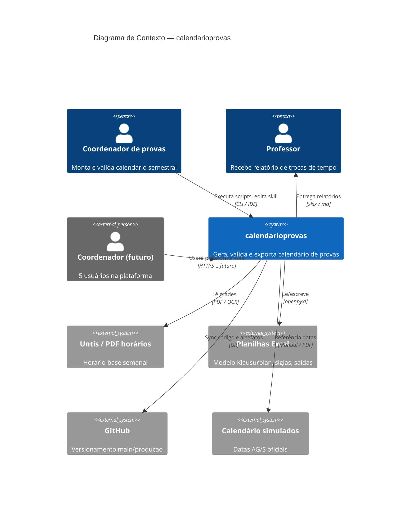

# C4 — Contexto (Nível 1)

> calendarioprovas — Escola Alemã Corcovado

## Personas

| Persona | Objetivo |
|---|---|
| Coordenador | Fechar calendário respeitando regras e carga docente |
| Professor | Saber quando cedeu tempo e quando aplica prova |
| Coordenador futuro | Mesmo fluxo, dados isolados na nuvem |
