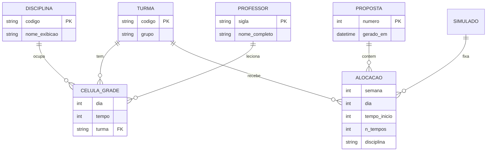

# ERD Completo — calendarioprovas

> Legado (conceitual, hoje em arquivos) + plataforma futura (PostgreSQL proposto).

---

## Legado — entidades em arquivos 🟢



---

## Plataforma futura — PostgreSQL 🟡

```mermaid
erDiagram
    INSTITUICAO ||--o{ COORDENADOR : emprega
    COORDENADOR ||--|| SEGMENTO : configura
    SEGMENTO ||--o{ SEMESTRE : escopo
    SEMESTRE ||--o{ ARQUIVO_ENTRADA : tem
    SEMESTRE ||--o{ CALENDARIO_GERADO : produz
    CALENDARIO_GERADO ||--o{ RELATORIO : gera
    INSTITUICAO ||--o{ REGRA_CATALOGO : publica
    SEGMENTO ||--o{ REGRA_CONFIG : toggles
    SEGMENTO ||--o{ CUSTOMIZACAO_IA : preferencias
    REGRA_CATALOGO ||--o{ REGRA_CONFIG : instancia

    COORDENADOR {
        uuid id PK
        string email UK
        string nome
    }
    SEGMENTO {
        uuid id PK
        uuid coordenador_id FK UK
        string nome
        jsonb turmas
        jsonb grupos_viagem
        jsonb params_default
    }
    SEMESTRE {
        uuid id PK
        uuid segmento_id FK
        int ano
        int periodo
        date inicio
        date fim
    }
    REGRA_CATALOGO {
        uuid id PK
        string codigo UK
        string descricao
        bool implementada_solver
        string skill_ref
    }
    REGRA_CONFIG {
        uuid id PK
        uuid segmento_id FK
        uuid regra_id FK
        uuid semestre_id FK
        bool ativo
        jsonb params
    }
    CUSTOMIZACAO_IA {
        uuid id PK
        uuid segmento_id FK
        uuid semestre_id FK
        text instrucao
        text contexto
        datetime created_at
    }
    ARQUIVO_ENTRADA {
        uuid id PK
        uuid semestre_id FK
        enum tipo
        string blob_path
    }
    CALENDARIO_GERADO {
        uuid id PK
        uuid semestre_id FK
        enum status
        string xlsx_blob_path
    }
    RELATORIO {
        uuid id PK
        uuid calendario_id FK
        enum tipo
        string blob_path
    }
```

> Nota: entidade `INSTITUICAO` e `REGRA_CATALOGO` substituem o modelo anterior `TEMPLATE_REGRAS` único — catálogo + toggles por segmento.

### Tipos enum propostos

| Enum | Valores |
|---|---|
| `arquivo_tipo` | grade, modelo, simulados, siglas, referencia |
| `relatorio_tipo` | trocas, tabela_turma, tempos_cedidos |
| `calendario_status` | pending, running, validating, completed, failed |

---

## Mapeamento legado → BD

| Legado | Tabela/coluna futura |
|---|---|
| `GRADES` hardcoded | `grade_celula` + import de PDF |
| `Horario desenvolvido/*.xlsx` | `calendario_gerado` + blob |
| `siglas/*.xlsx` | `arquivo_entrada` tipo siglas |
| SKILL.md | `regra_catalogo` (seed) + toggles |
| Toggles hardcoded → config | `regra_config.ativo` |
| Preferências textuais | `customizacao_ia` |

---

## Lacunas 🔴

- Normalização grade (por semestre vs snapshot imutável)
- Versionamento de propostas (histórico de reruns)
- Audit trail de quem relaxou regra 4
