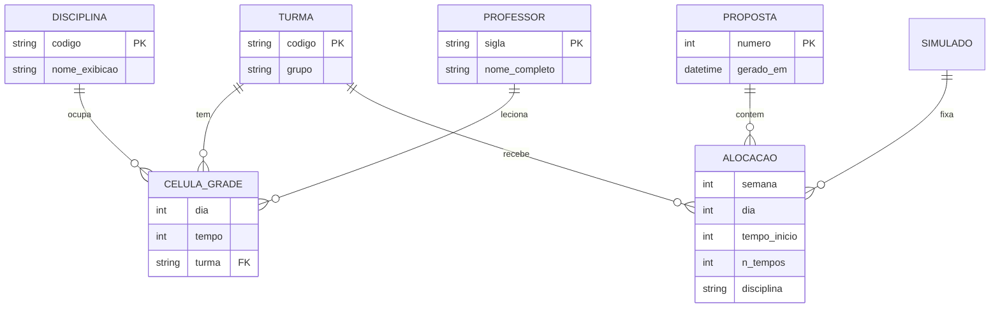
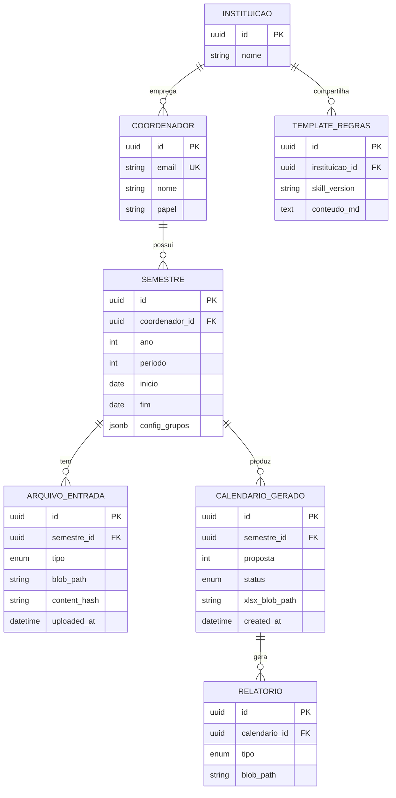

# ERD Completo — calendarioprovas

> Legado (conceitual, hoje em arquivos) + plataforma futura (PostgreSQL proposto).

---

## Legado — entidades em arquivos 🟢

---

## Plataforma futura — PostgreSQL 🟡

### Tipos enum propostos

| Enum | Valores |
|---|---|
| `arquivo_tipo` | grade, modelo, simulados, siglas, referencia |
| `relatorio_tipo` | trocas, tabela_turma, tempos_cedidos |
| `calendario_status` | pending, running, validating, completed, failed |

---

## Mapeamento legado → BD

| Legado | Tabela/coluna futura |
|---|---|
| `GRADES` hardcoded | `grade_celula` + import de PDF |
| `Horario desenvolvido/*.xlsx` | `calendario_gerado` + blob |
| `siglas/*.xlsx` | `arquivo_entrada` tipo siglas |
| SKILL.md | `template_regras` + versionamento |
| `FORCAR_DATA`, simulados | `semestre.config` JSON ou tabelas filhas |

---

## Lacunas 🔴

- Normalização grade (por semestre vs snapshot imutável)
- Versionamento de propostas (histórico de reruns)
- Audit trail de quem relaxou regra 4
