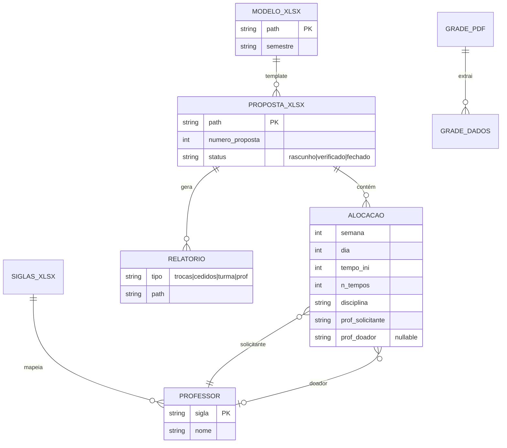
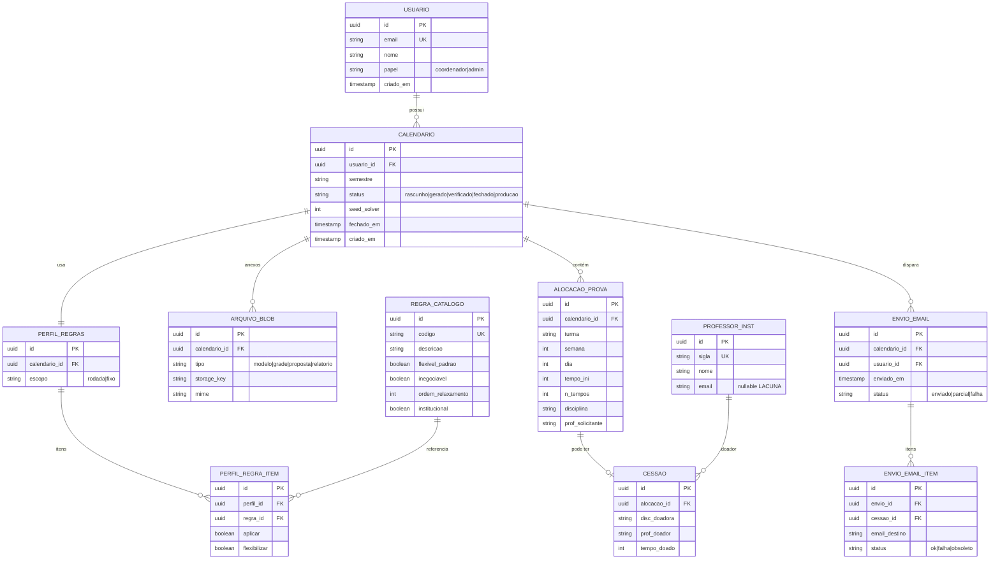

# ERD Completo — calendarioprovas

> Gerado pelo Arquiteto (Reversa) em 2026-08-15  
> Inclui modelo **legado conceitual** (arquivos) e **alvo PostgreSQL** (multi-coordenador)

---

## 1. Legado — modelo conceitual (sem BD) 🟢

Entidades inferidas de pastas e scripts; persistência = filesystem.

---

## 2. Alvo — PostgreSQL multi-coordenador 🟡

### Diagrama principal

---

## 3. Cardinalidades e constraints

| Relacionamento | Cardinalidade | Regra |
|---|---|---|
| Usuario → Calendario | 1:N | Coordenador só vê os seus 🟡 |
| Calendario → PerfilRegras | 1:1 | Um perfil por rodada de geração |
| RegraCatalogo → PerfilRegraItem | 1:N | Catálogo institucional + overrides |
| Alocacao → Cessao | 1:0..1 | Nem toda prova empresta tempo |
| Calendario → EnvioEmail | 1:N | Múltiplos envios possíveis 🔴 política |
| Cessao → EnvioEmailItem | 1:N | Reenvio / obsoleto |

---

## 4. Índices sugeridos 🟡

- `calendario(usuario_id, semestre, status)`
- `alocacao_prova(calendario_id, turma, semana, dia)`
- `cessao(prof_doador_id)` — listagem e-mail
- `envio_email(calendario_id, enviado_em DESC)`

---

## 5. Migração legado → BD 🔴

| Legado | Tabela alvo |
|---|---|
| `Klausurplan_*.xlsx` | `arquivo_blob` tipo=modelo |
| `Horario desenvolvido/Proposta_3_*.xlsx` | `arquivo_blob` + parse → `alocacao_prova` |
| Tupla `(doador)` no solver | `cessao` |
| `siglas_profs_aux_etc.xlsx` | `professor_inst` |
| Skill regras | seed `regra_catalogo` |
| `Relatorio_trocas` | view/query sobre `cessao` |
