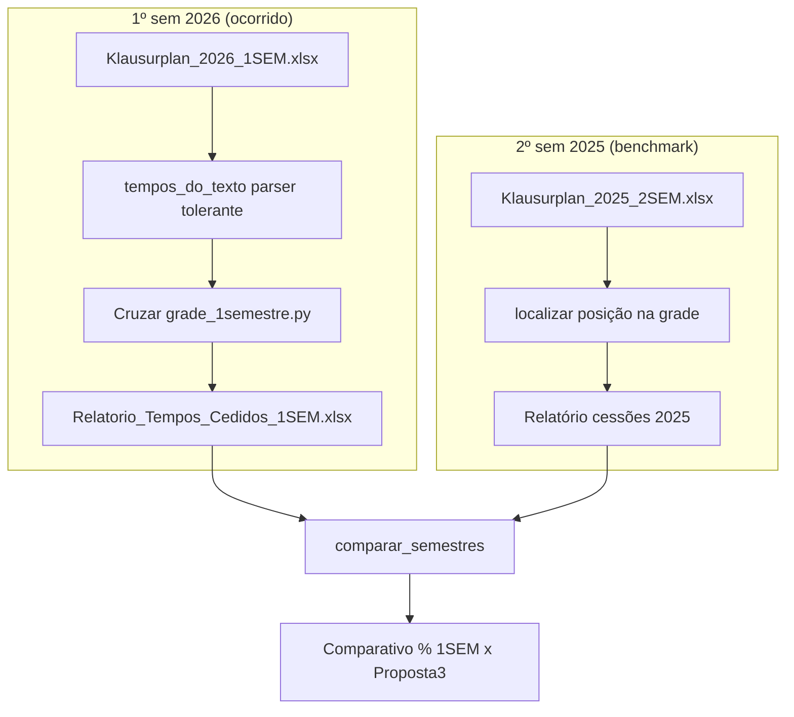

# Fluxograma — analise-historica

```mermaid
flowchart TD
    subgraph "1º sem 2026 (ocorrido)"
        A1[Klausurplan_2026_1SEM.xlsx] --> A2[tempos_do_texto parser tolerante]
        A2 --> A3[Cruzar grade_1semestre.py]
        A3 --> A4[Relatorio_Tempos_Cedidos_1SEM.xlsx]
    end

    subgraph "2º sem 2025 (benchmark)"
        B1[Klausurplan_2025_2SEM.xlsx] --> B2[localizar posição na grade]
        B2 --> B3[Relatório cessões 2025]
    end

    A4 --> C[comparar_semestres]
    B3 --> C
    C --> D[Comparativo % 1SEM x Proposta3]
```
