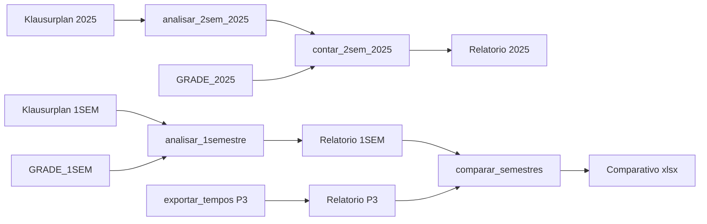

# Fluxograma — analise-historica

```mermaid
flowchart LR
    K1[Klausurplan 1SEM] --> A1[analisar_1semestre]
    G1[GRADE_1SEM] --> A1
    A1 --> R1[Relatorio 1SEM]
    
    K25[Klausurplan 2025] --> A25[analisar_2sem_2025]
    A25 --> C25[contar_2sem_2025]
    G25[GRADE_2025] --> C25
    C25 --> R25[Relatorio 2025]
    
    E3[exportar_tempos P3] --> R3[Relatorio P3]
    R1 --> CMP[comparar_semestres]
    R3 --> CMP
    CMP --> OUT[Comparativo xlsx]
```
