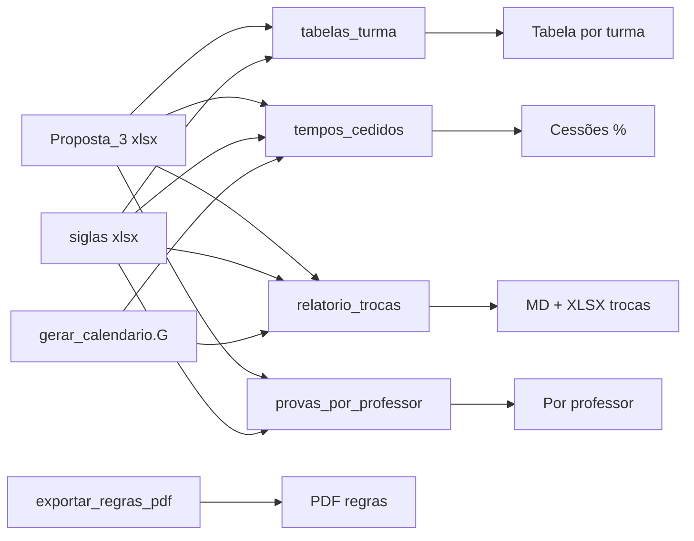

# Fluxograma — exportacao-relatorios

```mermaid
flowchart LR
    P3[Proposta_3 xlsx] --> T1[tabelas_turma]
    P3 --> T2[tempos_cedidos]
    P3 --> T3[relatorio_trocas]
    P3 --> T4[provas_por_professor]
    SIG[siglas xlsx] --> T1 & T2 & T3 & T4
    G[gerar_calendario.G] --> T2 & T3
    T1 --> O1[Tabela por turma]
    T2 --> O2[Cessões %]
    T3 --> O3[MD + XLSX trocas]
    T4 --> O4[Por professor]
    PDF[exportar_regras_pdf] --> O5[PDF regras]
```
