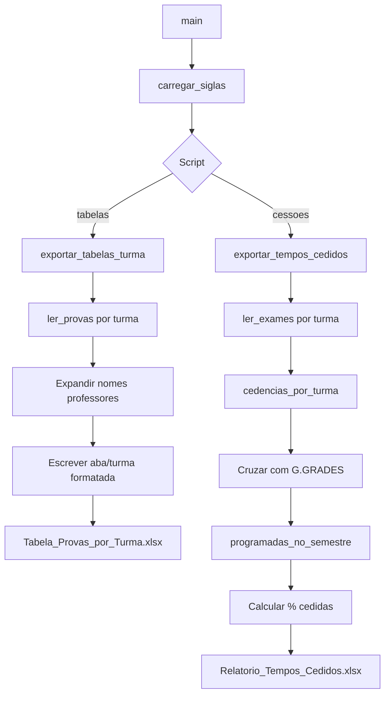

# Fluxograma — exportacao-relatorios

```mermaid
flowchart TD
    A[main] --> B[carregar_siglas]
    B --> C{Script}
    C -->|tabelas| D[exportar_tabelas_turma]
    C -->|cessoes| E[exportar_tempos_cedidos]

    D --> D1[ler_provas por turma]
    D1 --> D2[Expandir nomes professores]
    D2 --> D3[Escrever aba/turma formatada]
    D3 --> D4[Tabela_Provas_por_Turma.xlsx]

    E --> E1[ler_exames por turma]
    E1 --> E2[cedencias_por_turma]
    E2 --> E3[Cruzar com G.GRADES]
    E3 --> E4[programadas_no_semestre]
    E4 --> E5[Calcular % cedidas]
    E5 --> E6[Relatorio_Tempos_Cedidos.xlsx]
```
