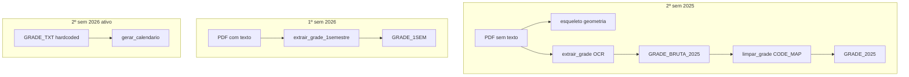

# Fluxograma — extracao-grade

```mermaid
flowchart TB
    subgraph y2025 [2º sem 2025]
        PDF25[PDF sem texto] --> ESQ[esqueleto geometria]
        PDF25 --> OCR[extrair_grade OCR]
        OCR --> BRUTA[GRADE_BRUTA_2025]
        BRUTA --> LIM[limpar_grade CODE_MAP]
        LIM --> G25[GRADE_2025]
    end
    subgraph y2026 [1º sem 2026]
        PDF26[PDF com texto] --> EXT26[extrair_grade_1semestre]
        EXT26 --> G1[GRADE_1SEM]
    end
    subgraph ativo [2º sem 2026 ativo]
        HARD[GRADE_TXT hardcoded] --> GEN[gerar_calendario]
    end
```
