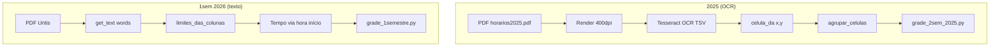

# Fluxograma — extracao-grade

```mermaid
flowchart TD
    subgraph "2025 (OCR)"
        A1[PDF horarios2025.pdf] --> A2[Render 400dpi]
        A2 --> A3[Tesseract OCR TSV]
        A3 --> A4[celula_da x,y]
        A4 --> A5[agrupar_celulas]
        A5 --> A6[grade_2sem_2025.py]
    end

    subgraph "1sem 2026 (texto)"
        B1[PDF Untis] --> B2[get_text words]
        B2 --> B3[limites_das_colunas]
        B3 --> B4[Tempo via hora início]
        B4 --> B5[grade_1semestre.py]
    end
```
