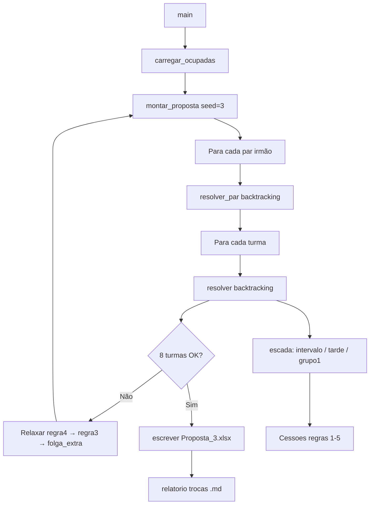

# Fluxograma — geracao-calendario

```mermaid
flowchart TD
    A[main] --> B[carregar_ocupadas]
    B --> C[montar_proposta seed=3]
    C --> D[Para cada par irmão]
    D --> E[resolver_par backtracking]
    E --> F[Para cada turma]
    F --> G[resolver backtracking]
    G --> H{8 turmas OK?}
    H -->|Não| I[Relaxar regra4 → regra3 → folga_extra]
    I --> C
    H -->|Sim| J[escrever Proposta_3.xlsx]
    J --> K[relatorio trocas .md]
    
    G --> L[escada: intervalo / tarde / grupo1]
    L --> M[Cessoes regras 1-5]
```
