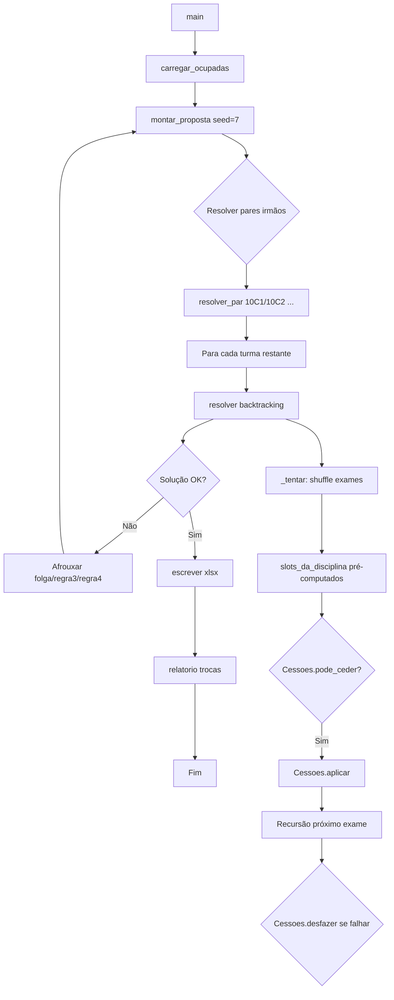

# Fluxograma — geracao-calendario

```mermaid
flowchart TD
    A[main] --> B[carregar_ocupadas]
    B --> C[montar_proposta seed=7]
    C --> D{Resolver pares irmãos}
    D --> E[resolver_par 10C1/10C2 ...]
    E --> F[Para cada turma restante]
    F --> G[resolver backtracking]
    G --> H{Solução OK?}
    H -->|Não| I[Afrouxar folga/regra3/regra4]
    I --> C
    H -->|Sim| J[escrever xlsx]
    J --> K[relatorio trocas]
    K --> L[Fim]

    G --> G1[_tentar: shuffle exames]
    G1 --> G2[slots_da_disciplina pré-computados]
    G2 --> G3{Cessoes.pode_ceder?}
    G3 -->|Sim| G4[Cessoes.aplicar]
    G4 --> G5[Recursão próximo exame]
    G5 --> G6{Cessoes.desfazer se falhar}
```

## Subfluxo: Cessoes (Proposta 3)

```mermaid
flowchart LR
    P[pode_ceder_bloco] --> R1[Teto regra 1/5]
    R1 --> R4[Regra 4 vesperas]
    R4 --> R3[Regra 3 sem contato]
    R3 --> OK[Permite cessão]
```
