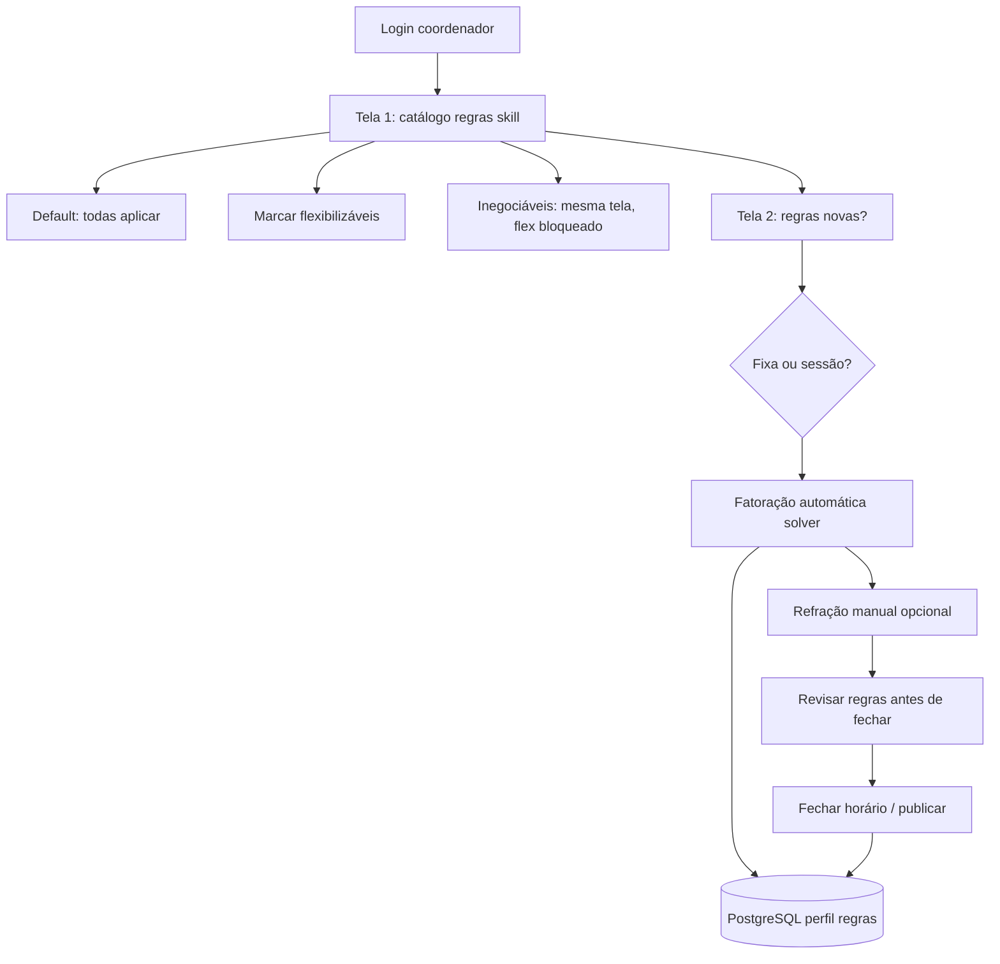

# Fluxograma — plataforma-multi-coordenador (futuro)

> 🔴 LACUNA — não implementado. Requisitos em `.reversa/context/user-requirements.md`.

```mermaid
flowchart TD
    LOGIN[Login coordenador] --> T1[Tela 1: catálogo regras skill]
    T1 --> D1[Default: todas aplicar]
    T1 --> D2[Marcar flexibilizáveis]
    T1 --> D3[Inegociáveis: mesma tela, flex bloqueado]
    T1 --> T2[Tela 2: regras novas?]
    T2 --> E{Fixa ou sessão?}
    E --> FAT[Fatoração automática solver]
    FAT --> REF[Refração manual opcional]
    REF --> GATE[Revisar regras antes de fechar]
    GATE --> FECHAR[Fechar horário / publicar]
    
    FAT --> PG[(PostgreSQL perfil regras)]
    FECHAR --> PG
```
