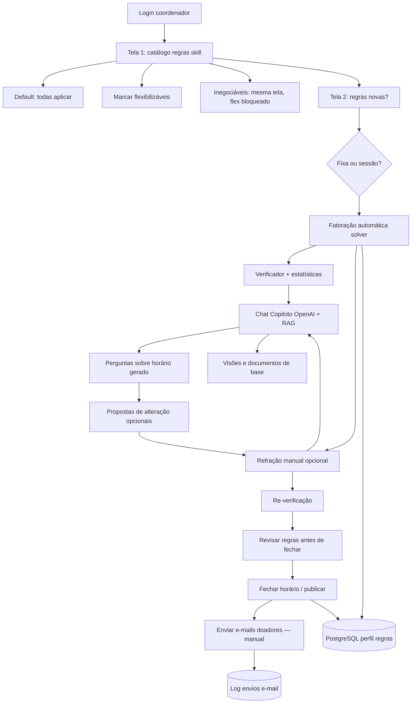

# Fluxograma — plataforma-multi-coordenador (futuro)

> 🔴 LACUNA — não implementado. Requisitos em `.reversa/context/user-requirements.md`.

**Nota:** o nó `EMAIL` é **ação explícita** do coordenador, não automática após refração.
