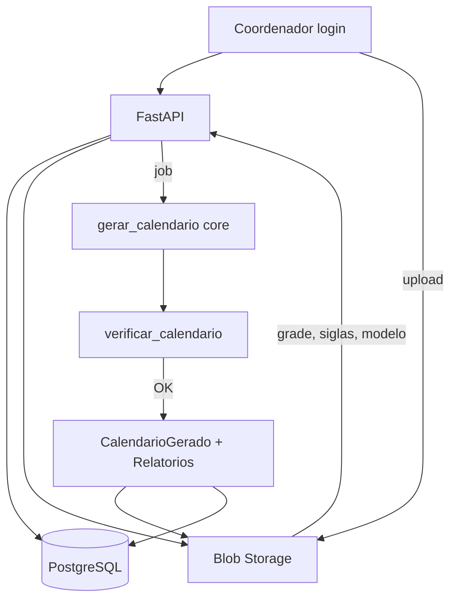

# Fluxograma — plataforma-multi-coordenador (futuro)

```mermaid
flowchart TD
    U[Coordenador login] --> API[FastAPI]
    API --> DB[(PostgreSQL)]
    API --> BLOB[Blob Storage]

    U -->|upload| BLOB
    BLOB -->|grade, siglas, modelo| API
    API -->|job| GEN[gerar_calendario core]
    GEN --> VAL[verificar_calendario]
    VAL -->|OK| OUT[CalendarioGerado + Relatorios]
    OUT --> BLOB
    OUT --> DB
```

> Diagrama preliminar 🟡 — detalhamento na fase Arquiteto.
