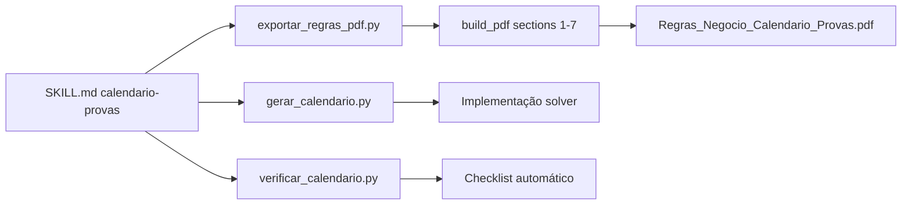

# Fluxograma — regras-negocio

```mermaid
flowchart LR
    A[SKILL.md calendario-provas] --> B[exportar_regras_pdf.py]
    B --> C[build_pdf sections 1-7]
    C --> D[Regras_Negocio_Calendario_Provas.pdf]

    A --> E[gerar_calendario.py]
    A --> F[verificar_calendario.py]

    E --> G[Implementação solver]
    F --> H[Checklist automático]
```
