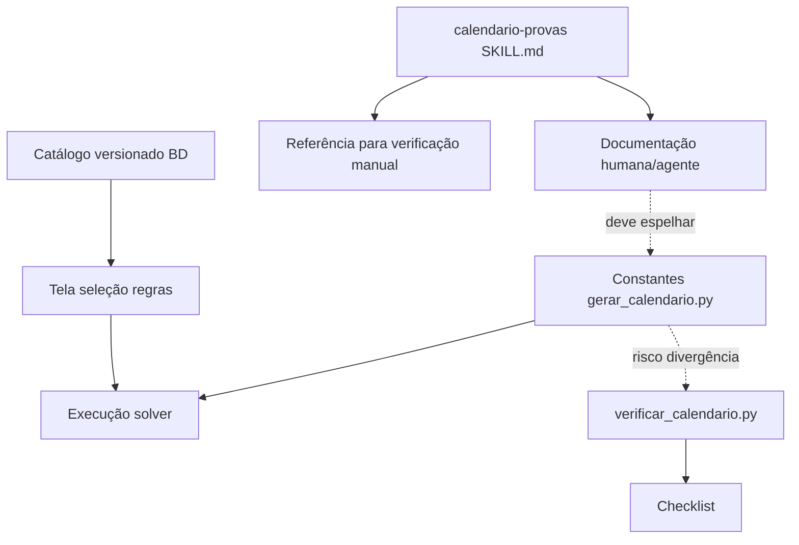

# Fluxograma — regras-negocio

```mermaid
flowchart TB
    SKILL[calendario-provas SKILL.md] --> DOC[Documentação humana/agente]
    SKILL --> REF[Referência para verificação manual]
    
    CODE[Constantes gerar_calendario.py] --> EXEC[Execução solver]
    VERIF[verificar_calendario.py] --> CHECK[Checklist]
    
    DOC -.->|deve espelhar| CODE
    CODE -.->|risco divergência| VERIF
    
    FUTURO[Catálogo versionado BD] --> UI[Tela seleção regras]
    UI --> EXEC
```
