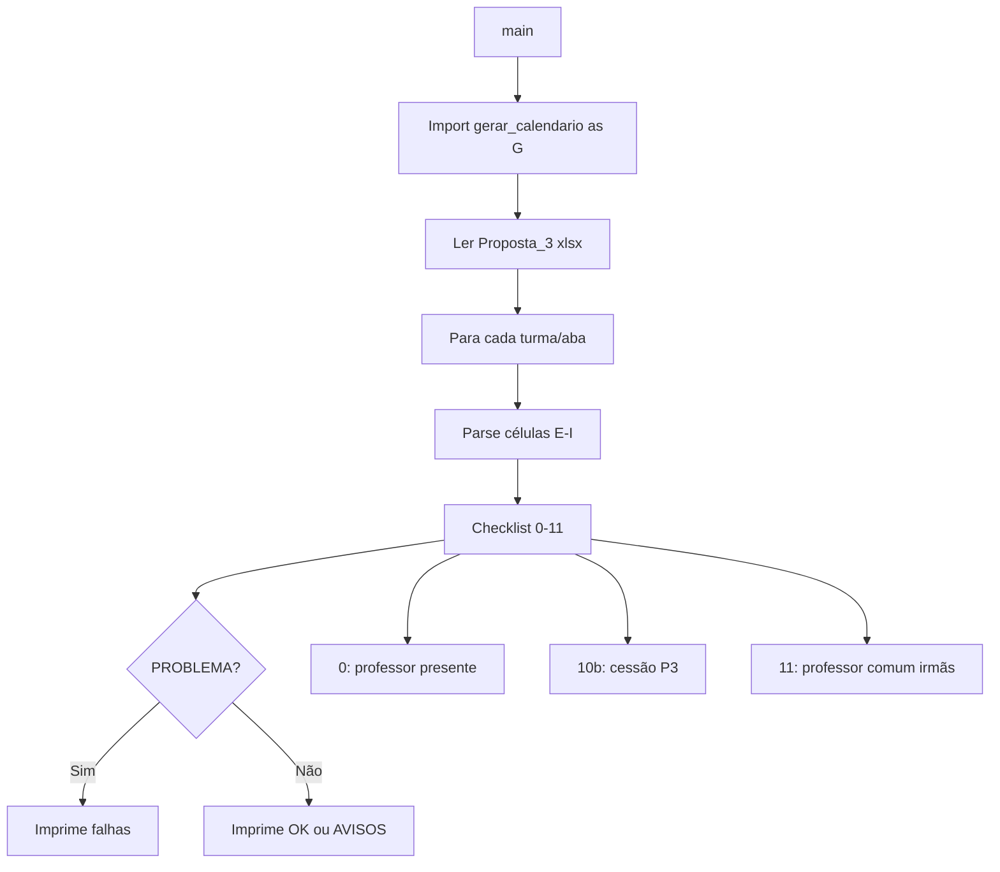

# Fluxograma — verificacao-calendario

```mermaid
flowchart TD
    A[main] --> B[Import gerar_calendario as G]
    B --> C[Ler Proposta_3 xlsx]
    C --> D[Para cada turma/aba]
    D --> E[Parse células E-I]
    E --> F[Checklist 0-11]
    F --> G{PROBLEMA?}
    G -->|Sim| H[Imprime falhas]
    G -->|Não| I[Imprime OK ou AVISOS]
    
    F --> F0[0: professor presente]
    F --> F10b[10b: cessão P3]
    F --> F11[11: professor comum irmãs]
```
