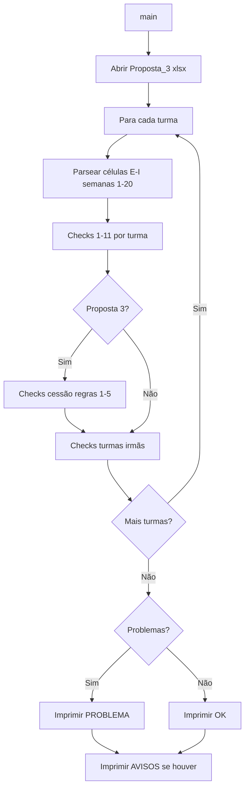
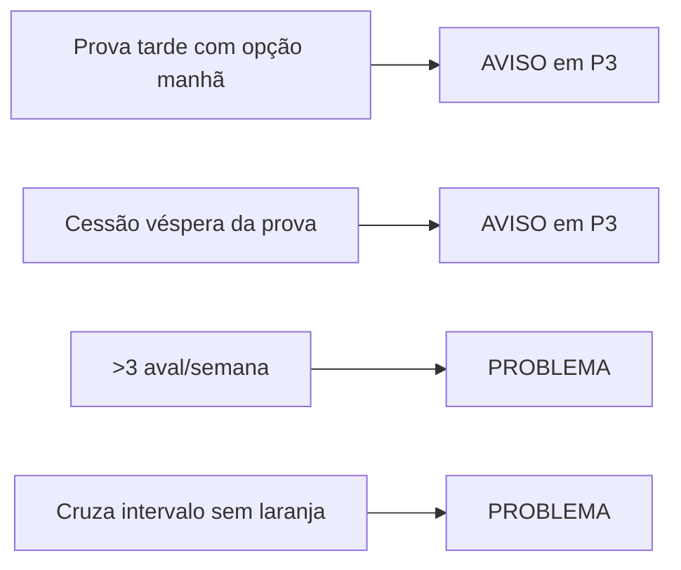

# Fluxograma — verificacao-calendario

```mermaid
flowchart TD
    A[main] --> B[Abrir Proposta_3 xlsx]
    B --> C[Para cada turma]
    C --> D[Parsear células E-I semanas 1-20]
    D --> E[Checks 1-11 por turma]
    E --> F{Proposta 3?}
    F -->|Sim| G[Checks cessão regras 1-5]
    G --> H[Checks turmas irmãs]
    F -->|Não| H
    H --> I{Mais turmas?}
    I -->|Sim| C
    I -->|Não| J{Problemas?}
    J -->|Sim| K[Imprimir PROBLEMA]
    J -->|Não| L[Imprimir OK]
    K --> M[Imprimir AVISOS se houver]
    L --> M
```

## Distinção problema vs aviso

```mermaid
flowchart LR
    R7b[Prova tarde com opção manhã] --> A1[AVISO em P3]
    R4[Cessão véspera da prova] --> A2[AVISO em P3]
    R1[>3 aval/semana] --> P1[PROBLEMA]
    R9[Cruza intervalo sem laranja] --> P2[PROBLEMA]
```
