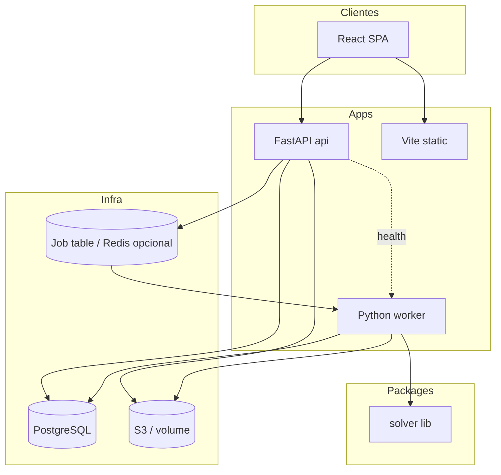

# Target Architecture — calendarioprovas

> Topologia: **modernizar** (ver `topology_decision.md`)  
> Paradigma: **híbrido pragmático** — camadas API + solver procedural preservado

## Visão geral

Monorepo com três apps deployáveis (api, worker, web) e pacote compartilhado `solver` que encapsula `gerar_calendario.py` e `verificar_calendario.py` refatorados. PostgreSQL para metadados multi-tenant; blob store para arquivos. Jobs assíncronos conectam API ao worker.

## Diagrama

## Componentes

| Componente | Tipo | Responsabilidade | Origem legado |
|------------|------|------------------|---------------|
| `apps/api` | API | Auth JWT, CRUD tenant, uploads, enqueue jobs | Novo (substitui CLI) |
| `apps/worker` | Worker | Pipeline solver + verificador + export | `gerar_calendario.py` main |
| `apps/web` | SPA | UI coordenador/admin | Novo (ADR-007) |
| `packages/solver` | Lib | Backtracking, cessão, export xlsx | `gerar_calendario.py`, verificador |
| PostgreSQL | DB | Tenants, regras, jobs, metadados | Arquivos locais |
| Blob store | Storage | Grade, modelo, xlsx, PDFs | cwd legado |

## Bounded contexts

| Context | Responsabilidade | Agregados principais |
|---------|------------------|---------------------|
| **Identidade** | Auth, RBAC | Coordenador, Instituicao |
| **Segmento** | Isolamento tenant, GRUPOS | Segmento, Grupo, Turma |
| **Semestre** | Ciclo escolar, entradas | Semestre, ArquivoEntrada |
| **Regras** | Catálogo, toggles, IA | RegraCatalogo, RegraConfig, CustomizacaoIA |
| **Calendário** | Geração, verificação, publish | CalendarioGerado, Job, Relatorio |

## Comunicação

- **Síncrona**: Browser ↔ API (REST/OpenAPI)
- **Assíncrona**: API enfileira job → Worker consome (tabela `jobs` ou Redis)
- **In-process**: Worker → Solver (sem rede)

## Honra ao paradigma escolhido

- API: routers → services → repositories com DI FastAPI
- Solver: **procedural preservado** — funções top-level refatoradas, não reescrita funcional
- Worker: orquestra pipeline imperativo (carregar → resolver → verificar → persistir)
- Frontend: componentes funcionais React + hooks

## Honra à topologia escolhida

- Nenhum script `.py` na raiz em produção
- OpenAPI em `apps/api` é contrato único web ↔ api
- `legacy/` read-only para paridade e referência durante Strangler
- Deploy independente: api+worker+postgres vs web static

## ADRs aplicáveis

| ADR | Título |
|-----|--------|
| 005 | FastAPI + PostgreSQL |
| 006 | Segmento, toggles, IA |
| 007 | React Vite + Tailwind |

## Rastreabilidade

| Elemento novo | Origem |
|-------------|--------|
| Job queue | `architecture.md` worker assíncrono |
| RuleContext | `regras-negocio/design.md` |
| GRUPO entity | ADR-006, descarta hardcode BR-DESCARTAR-005 |
