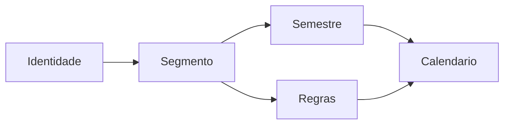

# Target Domain Model

## Context map

## Agregados

### Coordenador (Identidade)
- **ID**: uuid
- **Invariantes**: email único; 1:1 com Segmento (exceto admin_instituicao)
- **Origem**: `permissions.md`

### Segmento
- **ID**: uuid
- **Invariantes**: isolamento — queries sempre filtram por segmento_id
- **Origem**: ADR-006

### Grupo
- **Campos**: nome, data_inicio_semestre, data_fim_semestre, datas_segunda_chamada[], conselho_inicio, conselho_fim
- **Invariantes**: conselho_inicio ≤ conselho_fim; turmas referenciam grupo_id
- **Origem**: `plataforma-multi-coordenador/design.md` — substitui hardcode legado

### Turma
- **Campos**: codigo (10C1…), grupo_id
- **Origem**: `domain.md`

### Semestre
- **Campos**: ano, periodo, inicio, fim, segmento_id
- **Origem**: `erd-complete.md`

### RegraCatalogo
- **Campos**: codigo, descricao, implementada_solver, skill_ref
- **Origem**: `regras-negocio/requirements.md` RF-01

### RegraConfig
- **Campos**: segmento_id, semestre_id, regra_id, ativo, params (jsonb)
- **Comportamento**: compõe RuleContext enviado ao solver
- **Origem**: ADR-006, RF-08

### CustomizacaoIA
- **Campos**: instrucao, contexto, segmento_id, semestre_id
- **Comportamento**: usada em verificador + relatório auxiliar; **não** altera solver
- **Origem**: decisão Brener 2026-08-09

### ArquivoEntrada
- **Tipos**: grade, modelo, siglas, simulados
- **Campos**: blob_path, checksum, semestre_id
- **Origem**: `extracao-grade/requirements.md`

### CalendarioGerado
- **Estados**: pending → running → verified → published | failed
- **Campos**: xlsx_blob_path, job_id, verificacao_result (json)
- **Origem**: `state-machines.md`

### Job
- **Estados**: queued → running → completed | failed
- **Payload**: semestre_id, proposta_numero, rule_context_snapshot
- **Origem**: novo (substitui execução CLI síncrona)

## Value objects

| VO | Campos | Uso |
|----|--------|-----|
| RuleContext | regras_ativas[], params, grupos[] | Input solver |
| Cessao | origem, destino, professor, tempos | Relatório trocas |
| Alocacao | semana, dia, tempo_inicio, n_tempos, disciplina | xlsx |

## Domain services

| Serviço | Responsabilidade |
|---------|------------------|
| RuleContextBuilder | Monta contexto a partir RegraConfig + Grupo |
| SolverPipeline | Invoca packages/solver com entradas blob |
| VerificadorPipeline | Pós-job; gate publish |
| ParidadeComparator | Diff xlsx CLI vs plataforma (Parallel Run) |

## Eventos (opcional v1)

| Evento | Disparo |
|--------|---------|
| CalendarioGerado | job completed + verificacao OK |
| CalendarioPublicado | coordenador publish |
| RegraToggleAlterada | PATCH regras (audit log futuro) |

## Descartes (ver discard_log)

- Entidades "arquivo local cwd" → ArquivoEntrada + blob
- "Grupo viagem hardcoded" → Grupo configurável
