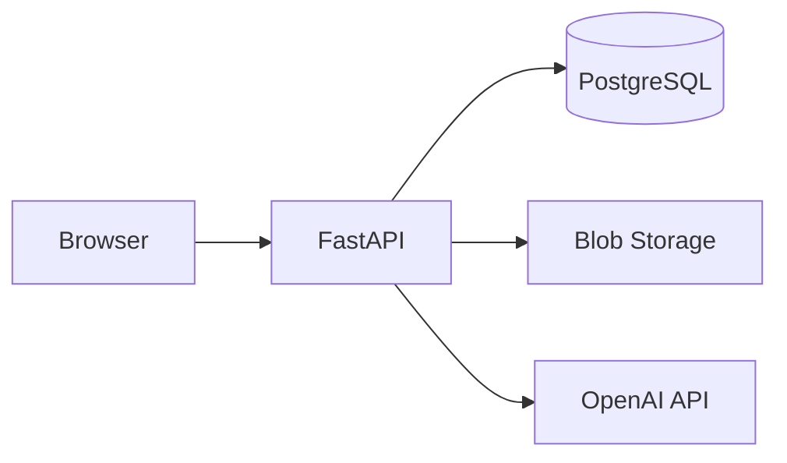

# Plataforma Multi-Coordenador — Design

> Ver `_reversa_sdd/architecture.md`, `c4-*.md`, `erd-complete.md`

## Containers (alvo)



## Máquina de estados calendário

Ver `_reversa_sdd/state-machines.md`: EntradasCarregadas → PropostaGerada → EmRefracao → Fechado.

## Pipeline fatoração

```
GradeParserService
  + ExamCatalogService
  + CalendarConstraintsService (CalendarBlockPicker)
  + RulesCatalogService (snapshot)
  → CalendarSolver (job)
  → escrever() → blob Proposta_3.xlsx
  → CalendarVerifier
  → CalendarPreviewView
```

## Copiloto (ADR-008)

- `ScheduleCopilotService`, `RagIndexService`, `PythonActionBridge`, `ProfessorPseudonymService`
- Tool calling whitelist; confirmação humana

## Deploy híbrido

- Docker Compose: api + postgres + frontend + volume blobs
- Nuvem: managed Postgres + S3 🟡

## API surface (resumo)

Prefixo `/api/v1/` — ver `openapi/calendarioprovas.yaml` (global Redator).

## Segurança

- JWT/session por coordenador 🟡
- Blobs scoped por `usuario_id` 🟡
- OpenAI key só backend 🟢
