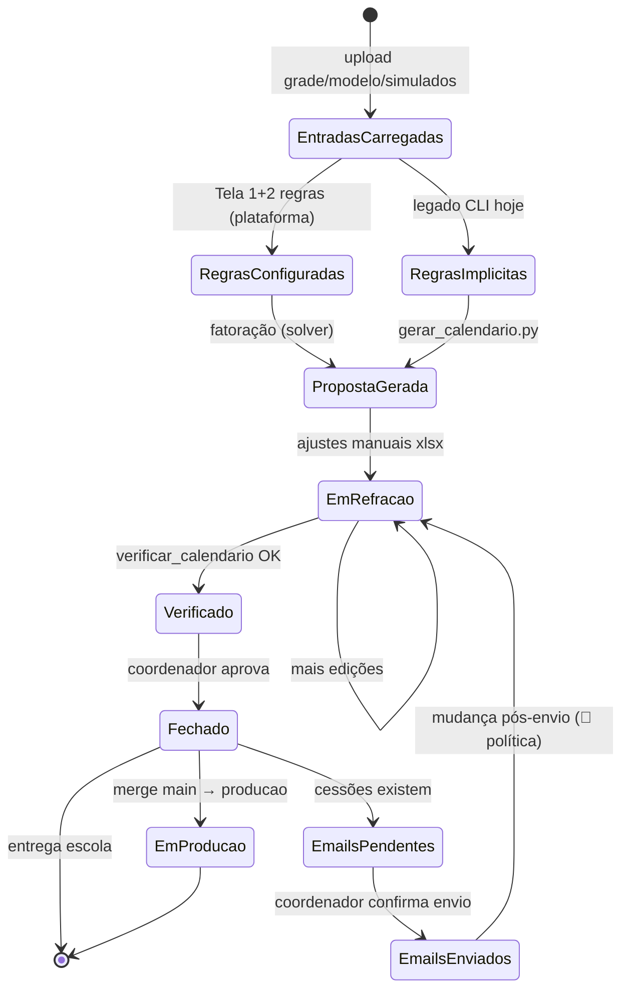
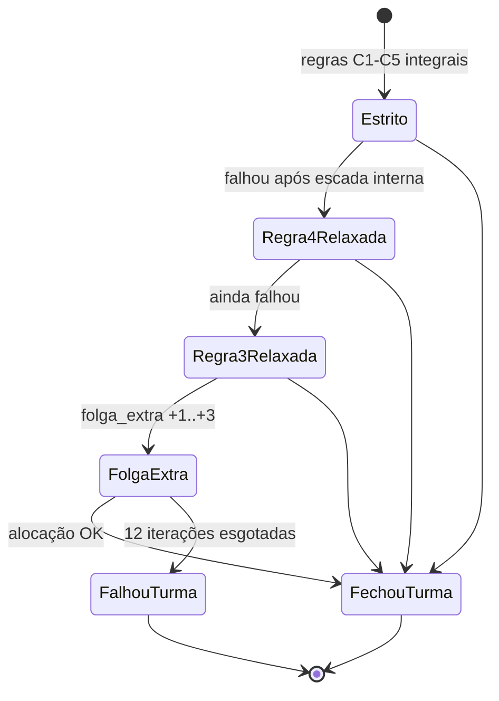
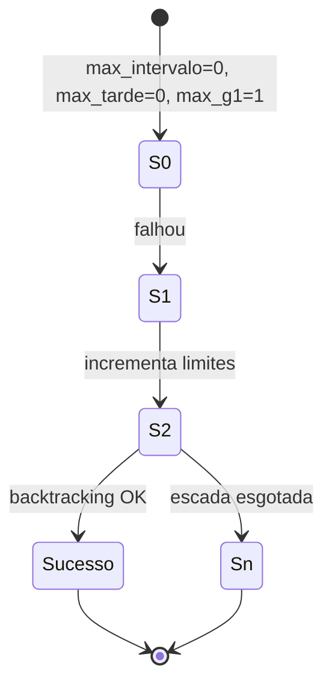
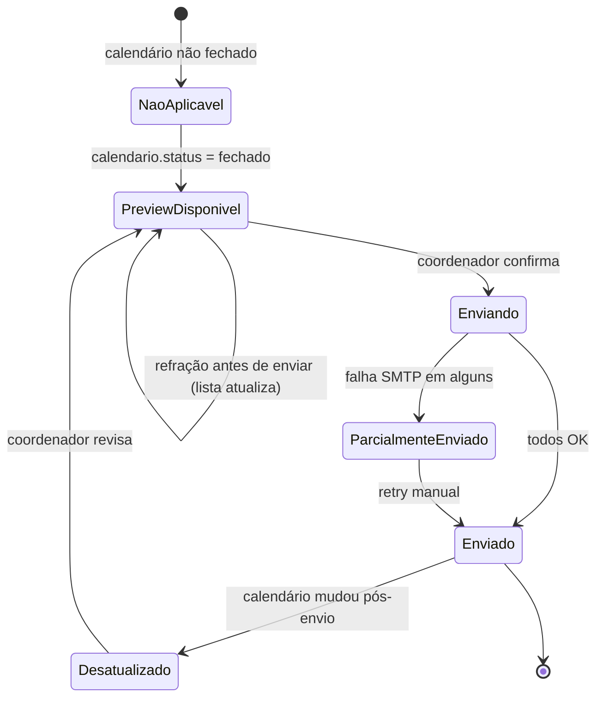

# Máquinas de estado — calendarioprovas

> Gerado pelo Detetive (Reversa) em 2026-08-15

---

## 1. Ciclo de vida do calendário (semestre)

Entidade central do domínio. Estados inferidos do fluxo Git + scripts + requisitos de plataforma.

| Transição | Gatilho | Confiança |
|---|---|---|
| → PropostaGerada | `python gerar_calendario.py` | 🟢 |
| → EmRefracao | Edição células Proposta_3 xlsx | 🟢 |
| → Verificado | `verificar_calendario.py` sem PROBLEMA | 🟢 |
| → Fechado | Decisão humana / publicar | 🟡 |
| → EmProducao | `promover_para_producao.bat` | 🟢 |
| → EmailsEnviados | Ação manual coordenador | 🟡 (requisito) |

---

## 2. Relaxamento de cessão (por turma, Proposta 3)

Submáquina dentro do solver quando limites estritos não fecham.

🟢 Confirmado em `montar_proposta()` / `main()` L2079–2126.

---

## 3. Escada interna do solver (por tentativa)

🟢 `escada()` L789–809.

---

## 4. Envio de e-mail ao doador (plataforma futura)

🔴 Política de `Desatualizado` a definir com usuário.

---

## 5. Item de cessão (rastreabilidade e-mail)

| Estado | Significado |
|---|---|
| `calculada` | Existe no relatório de trocas |
| `email_pendente` | Calendário fechado, e-mail não enviado |
| `email_enviado` | Registro em `enviado_em` |
| `email_obsoleta` | Cessão removida ou alterada após envio |

🟡 Inferido dos requisitos de auditoria.
