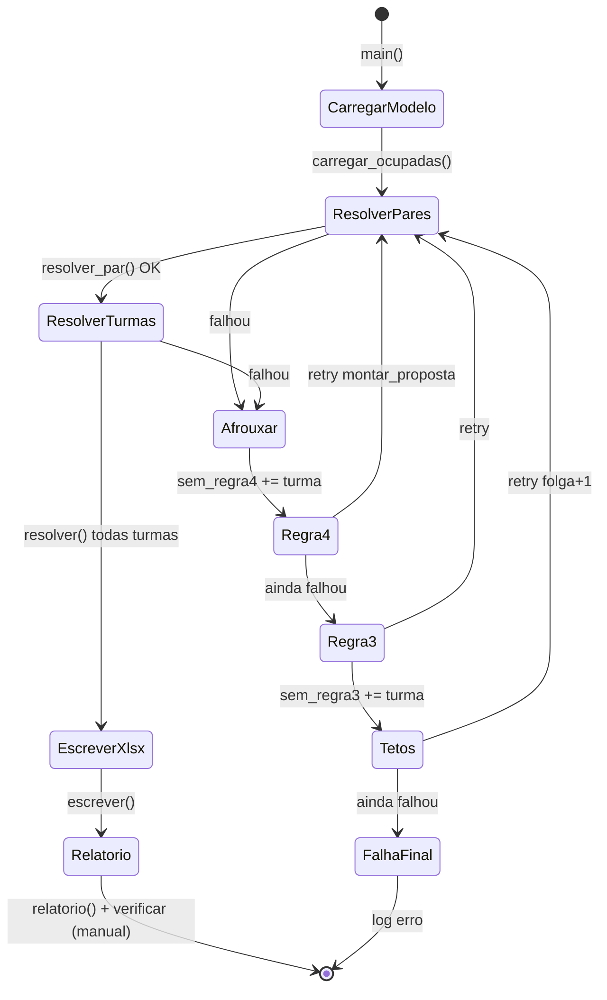
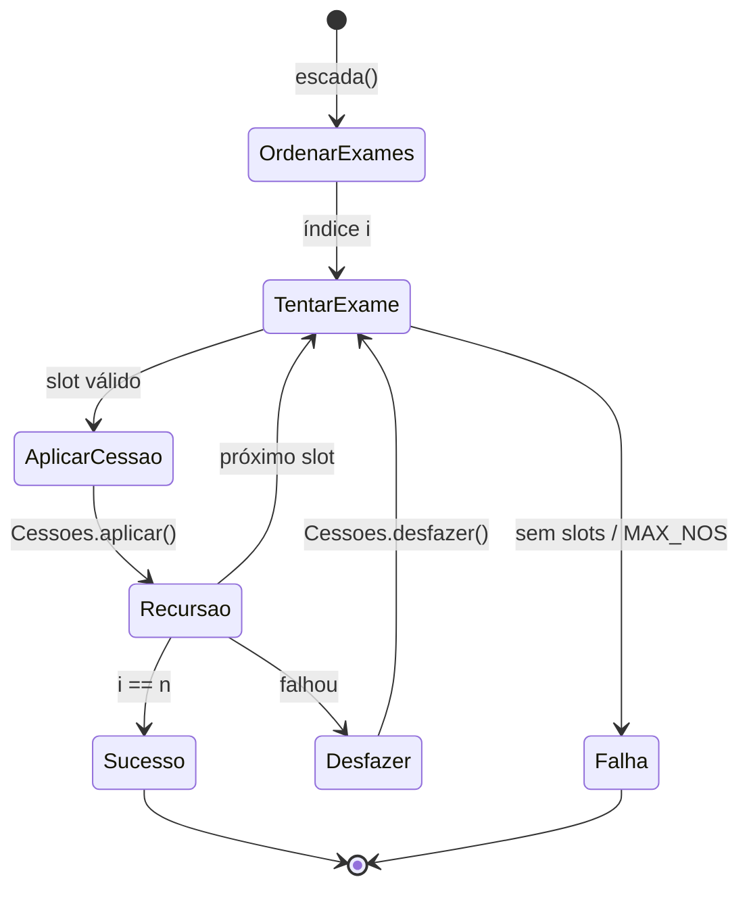
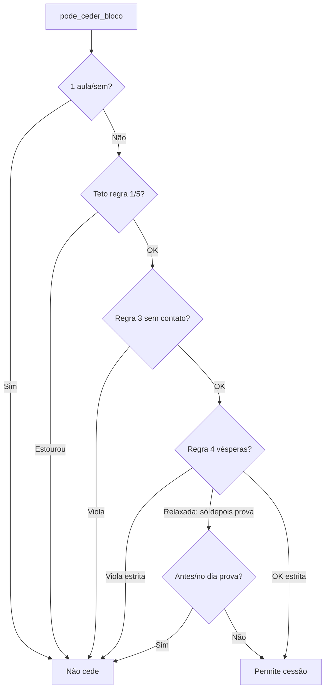
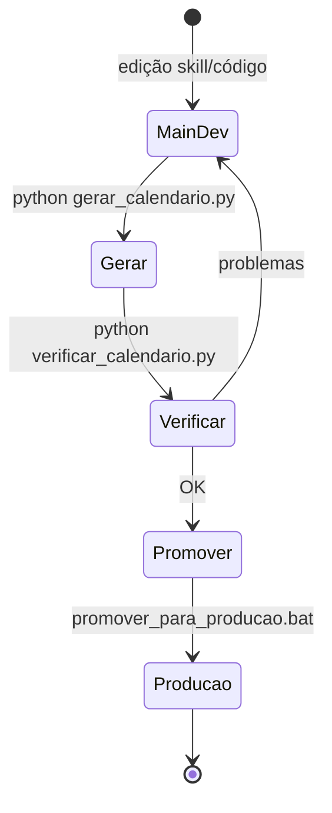
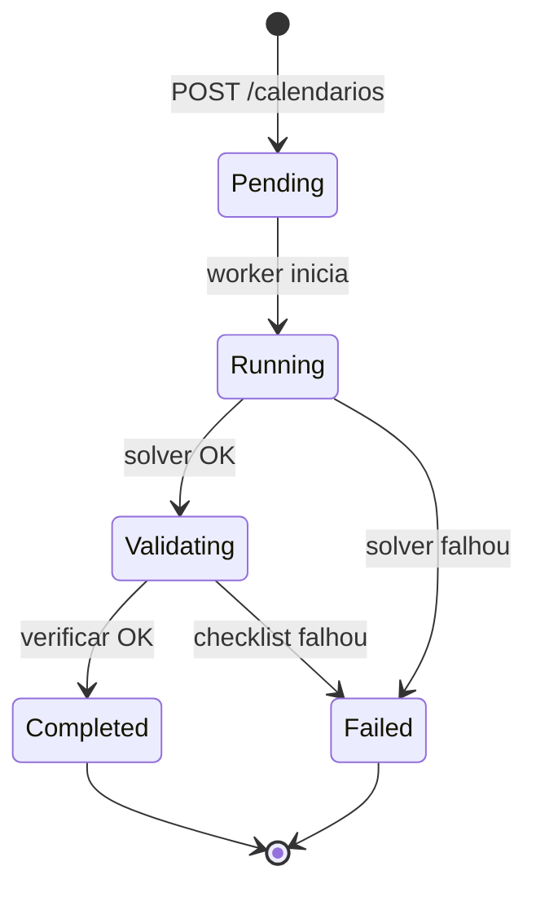

# Máquinas de estado — calendarioprovas

> Gerado pelo Detetive (Reversa).

---

## 1. Ciclo de vida de uma Proposta de calendário

**Estados implícitos:** `folga` (incremento de tetos), `sem_regra3`, `sem_regra4` por turma 🟢

---

## 2. Backtracking por turma (`resolver`)

---

## 3. Classe `Cessoes` — decisão por slot candidato

---

## 4. Fluxo Git de validação (operacional)

🟡 Inferido de `referencia/fluxo-git-main-producao.md`

---

## 5. Plataforma futura — job de geração (proposto)

🔴 Lacuna — não implementado; 🟡 inferido para FastAPI + fila
