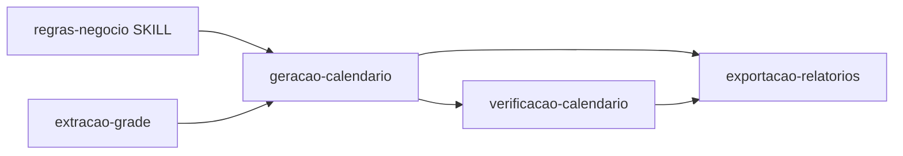

# Spec Impact Matrix — legado → plataforma

> Gerado pelo Arquiteto (Reversa).  
> Linhas: features legado. Colunas: impacto na plataforma futura.

---

## Matriz principal

| Feature legado | Componente legado | Persistência hoje | Plataforma futura | Impacto | Esforço |
|---|---|---|---|---|---|
| geracao-calendario | `gerar_calendario.py` | xlsx + constants in-code | API job + worker + config BD | **Alto** — externalizar constantes | Alto |
| verificacao-calendario | `verificar_calendario.py` | stdout | Endpoint pós-job automático | Médio — desacoplar import | Médio |
| exportacao-relatorios | `exportar_*.py` | xlsx | Blob + download API | Médio — manter openpyxl | Médio |
| extracao-grade | `extrair_grade_*.py` | .py gerado | Upload PDF + job OCR | Alto — pipeline assíncrono | Alto |
| analise-historica | `analisar_*.py` | xlsx | Relatórios comparativos BD | Baixo — opcional v2 | Baixo |
| regras-negocio | SKILL.md | git | `template_regras` versionado | Médio — sync skill↔BD | Médio |
| plataforma-multi-coordenador | — | — | Segmento + RBAC + rule engine | **Novo** | Alto |
| regras-configuraveis | skill + hardcode | git | Catálogo + toggles + IA | **Novo** | Alto |
| sync git | `*.bat` | git | CI/CD + API (substitui parcial) | Médio | Médio |

---

## Dependências entre features (legado)

---

## Ordem de migração sugerida 🟡

1. **Auth + Semestre + Upload** (entradas blob)
2. **Externalizar grade/simulados/feriados** do hardcode
3. **Worker solver** (wrap `montar_proposta`)
4. **Verificação automática** pós-job
5. **Exportadores** como endpoints
6. **RBAC** completo + templates institucionais

---

## Rastreabilidade regras → código → spec

| Regra (domain.md) | Código | Spec feature (futuro) |
|---|---|---|
| Cessão 1–5 | `Cessoes` | `geracao-calendario/design.md` |
| LP/LIT/RED 10 dias | 🔴 lacuna | `regras-negocio/requirements.md` |
| Checklist 30 itens | `verificar_calendario` | `verificacao-calendario/requirements.md` |
| Multi-coordenador | 🔴 | `plataforma-multi-coordenador/*` |

---

## ADRs relacionados

- ADR-001 Proposta 3 only
- ADR-002 Cessão
- ADR-003 Regra 4
- ADR-004 Skill fonte viva
- ADR-006 Segmento + regras configuráveis + IA
