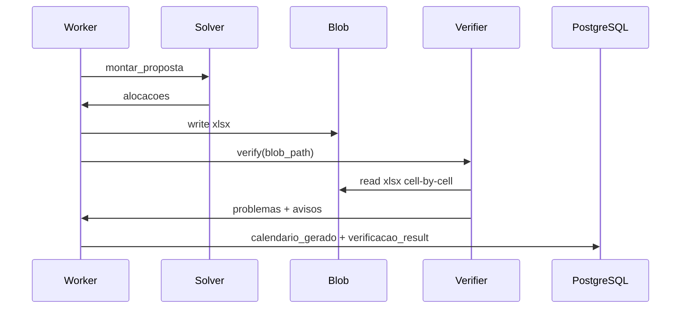

# Verificação de Calendário — Design Técnico

> **Princípio central (ADR-010):** auditoria do **xlsx gravado**, nunca da memória do gerador.

## Papel no sistema

| Papel | Descrição |
|-------|-----------|
| **Auditor** | Relê `Proposta_3_...xlsx` com `openpyxl` (`data_only=True`), parse células E–I, semanas 1–20, 8 abas |
| **Gate** | PROBLEMA → bloqueia publish; AVISO → informativo |
| **Independente** | Não recebe `alocacoes` nem estruturas do solver; só o arquivo + constantes compartilhadas (grade, limites) |

## Interface

| Símbolo | Assinatura | Retorno | Observação |
|---------|-----------|---------|------------|
| `main` | `()` | `void` | Itera 8 abas xlsx; acumula `problemas[]` e `avisos[]` |
| `data_da` | `(ws, w, d)` | `date` | Converte semana/dia → data calendário |

### Entidade

| Campo | Tipo | Descrição |
|-------|------|-----------|
| ProblemaValidacao.turma | string | Aba/turma |
| ProblemaValidacao.regra | string | ID ou nome da regra |
| ProblemaValidacao.mensagem | string | Detalhe humano-legível |
| ProblemaValidacao.severidade | string | `erro` (PROBLEMA) \| `aviso` (AVISO) |

### API futura 🟡

| Método | Caminho | Saída |
|--------|---------|-------|
| POST | `/api/v1/calendarios/{id}/verificar` | `{ ok, problemas[], avisos[] }` — lê **blob xlsx** |

## Fluxo Principal

1. Abrir xlsx calendário **já gravado** (`Horario desenvolvido/Proposta_3_...xlsx`) 🟢
2. Para **cada uma das 8 turmas** (aba): extrair provas célula a célula 🟢
3. Executar bateria de checks (semanais, diários, distância, cessão, simulados, prioridade 1 professor…) 🟢
4. Cruzar com grade-base (hoje importada de `gerar_calendario`; futuro `GradeSnapshot` aprovado) 🟢
5. Agregar em `problemas` (PROBLEMA) e `avisos` (AVISO) 🟢
6. Imprimir/responder: PROBLEMA bloqueia; AVISO listado separadamente 🟢

## Fluxos Alternativos

- **Arquivo inexistente/malformado:** Erro imediato 🟢
- **Regras relaxadas (1, 4, 5, 7b em P3):** → **AVISO**, não PROBLEMA 🟢
- **Violação real (ex.: >3 provas/semana, cessão regra 3):** → **PROBLEMA** 🟢

## Dependências

- openpyxl 🟢
- Constantes compartilhadas (grade, limites, pares) — **desacoplar para RuleContext + GradeSnapshot** 🟡
- Grade-base aprovada 🟢

## Decisões de Design

| Decisão | Evidência | Confiança |
|---------|-----------|-----------|
| Leitura xlsx, não memória | docstring L5-6 | 🟢 |
| PROBLEMA vs AVISO | stdout L383-393 | 🟢 |
| 8 turmas | loop `G.GRADES` | 🟢 |
| Espelho da skill | comentários checks 0-11 | 🟢 |

## Pipeline plataforma (T6)

## Riscos e Lacunas

- 🟡 Refactor: `packages/verifier` importável, entrada = path/blob
- 🟡 Acoplamento `import gerar_calendario as G` — remover na plataforma
- 🔴 Validação ARGB de cores (Could)
